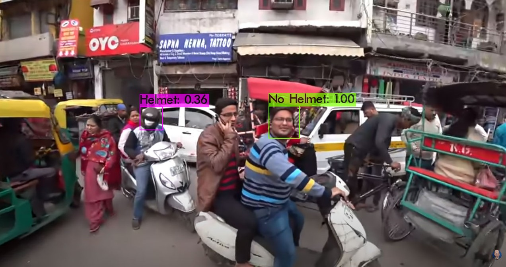

# Helmet-Detection
Real time object detection is implemented using [YOLOv4](https://github.com/AlexeyAB/darknet)

## Demo
### Detection on an image

  

### Detection on a video

  

## Reference
- [YOLOv4](https://github.com/AlexeyAB/darknet) installation
- [CUDA & cuDNN installation on Ubuntu 20.04](https://medium.com/analytics-vidhya/installing-tensorflow-with-cuda-cudnn-gpu-support-on-ubuntu-20-04-f6f67745750a) by Rohan Paul
- [Training custom model](https://www.youtube.com/watch?v=zJDUhGL26iU&t=831s&ab_channel=TheAIGuy) by TheAIGuy
- [Quick and easy dataset creation](https://www.youtube.com/watch?v=_4A9inxGqRM&ab_channel=TheAIGuy) by TheAIGuy
- Google Chrome extenstion to download images [Download All Images](https://chrome.google.com/webstore/detail/download-all-images/ifipmflagepipjokmbdecpmjbibjnakm?hl=en) 
- Images annotation tool [labelImg](https://github.com/tzutalin/labelImg)
